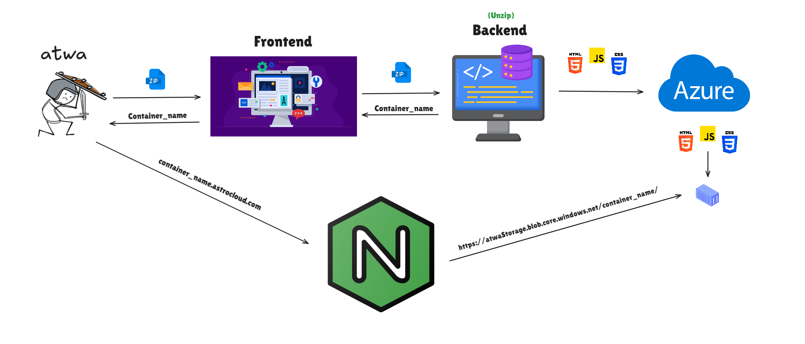
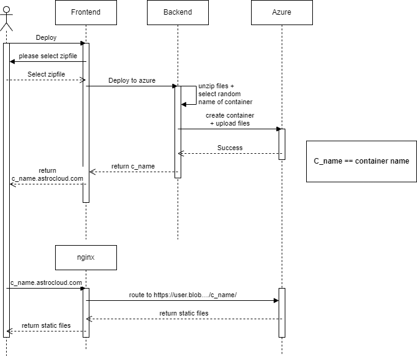

# Static Hosting on Azure PoC

This is a proof of concept for a static hosting service on Azure. The service takes ZIP files containing static content, uploads the content to Azure Blob Storage, and returns a custom subdomain for the content.

The subdomain routes to an NGINX web server that acts as a proxy, dynamically calculates the destination URL and forwards the request to the Azure Blob Storage.

## Architecture



## Sequence Diagram



## Setup

### Prerequisites

- Azure account
- Azure Storage Account
- Azure CLI or App registration credentials

### Setup Steps

The application is fully containerized and can be run using Docker. You will need an Application Registration in Azure to authenticate with the Azure Storage Account. If you can't make an App Registration, you can use the Azure CLI to authenticate, but then will need to run the application locally, not in a container.

1. Clone the repository
2. Inside `devops/server.conf`, replace all "atwaa" strings with your Azure Storage Account name.
3. Inside `backend`, rename `example.env` to `.env` and fill in the required values. If running locally, only fill `AZURE_STORAGE_ACCOUNT_NAME`. If running in a container, fill in all values.

4. To run the application in a container, run the root `docker-compose.yml` file:
    ```bash
    docker compose up
    ```

5. To run the application locally, navigate to the `backend` directory and run:

    ```bash
    npm install
    npm run dev
    ```
        
    Repeat for `frontend` directory. Then run the docker compose inside the `devops` directory.

